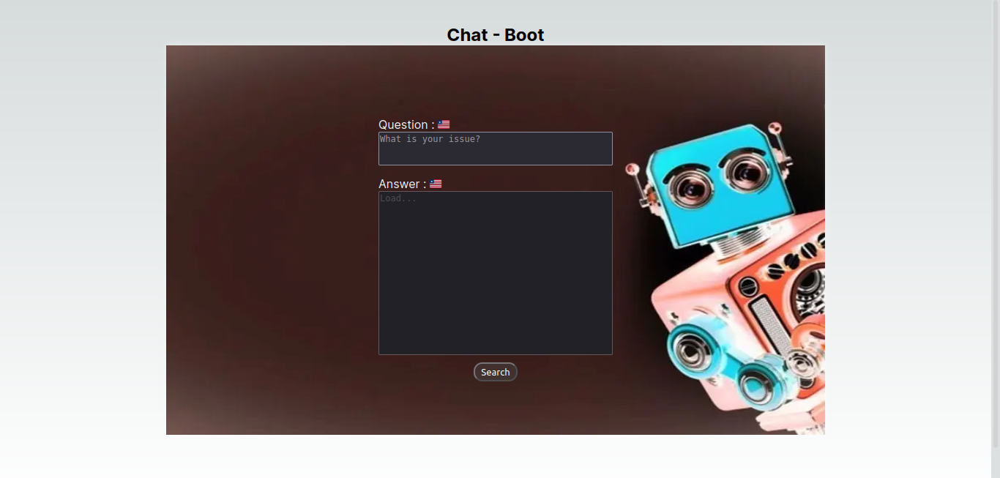

# OpenAI-nodejs-nextjs
  a simple question and answer app using Nextjs, Nodejs and the OpenAI API.

## technologies used : 🛠️

[Nextjs](https://nextjs.org/docs/getting-started) |
[Nodejs](https://nodejs.org/en/) |
[VS Code](https://code.visualstudio.com/download) |
[API ChatBoot](https://platform.openai.com/docs/api-reference/models/retrieve) </>
[Api-keys](https://platform.openai.com/account/api-keys)

###### Author : Aniceto Jolela 🥰
 My  | [Linkedin](https://www.linkedin.com/in/aniceto-jolela-076547184/))
